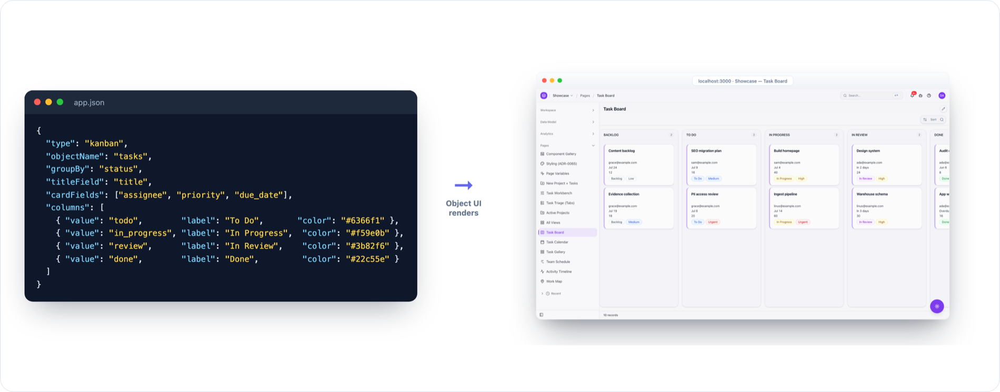
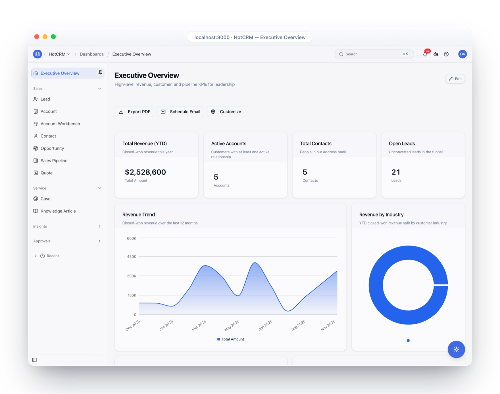
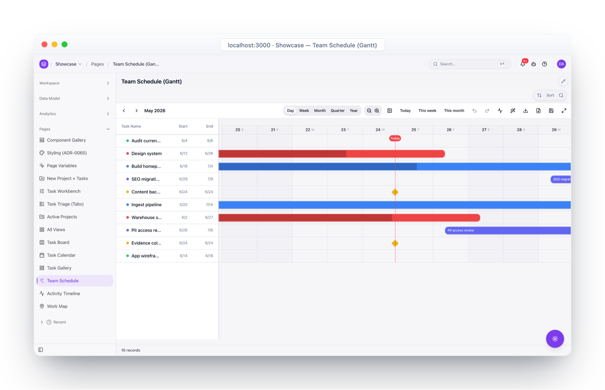
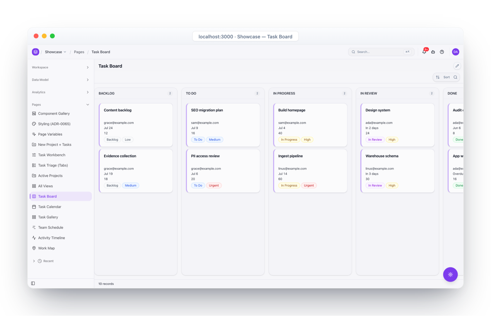
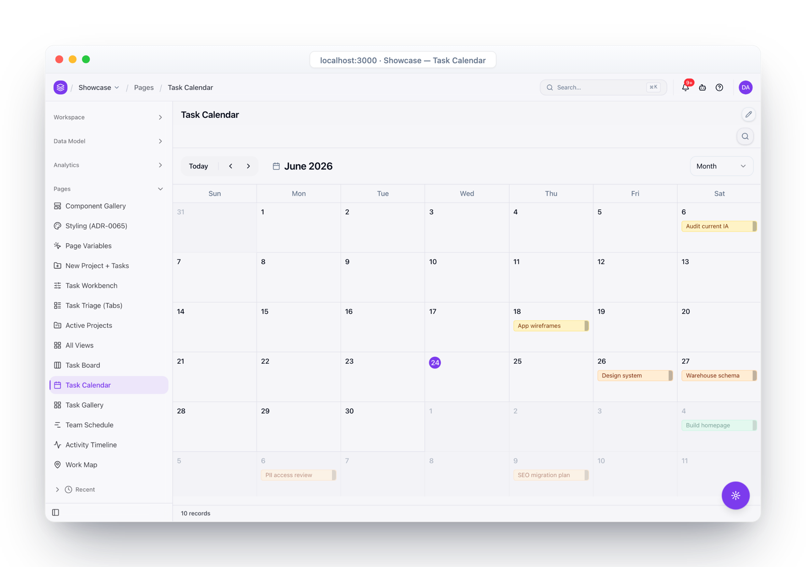
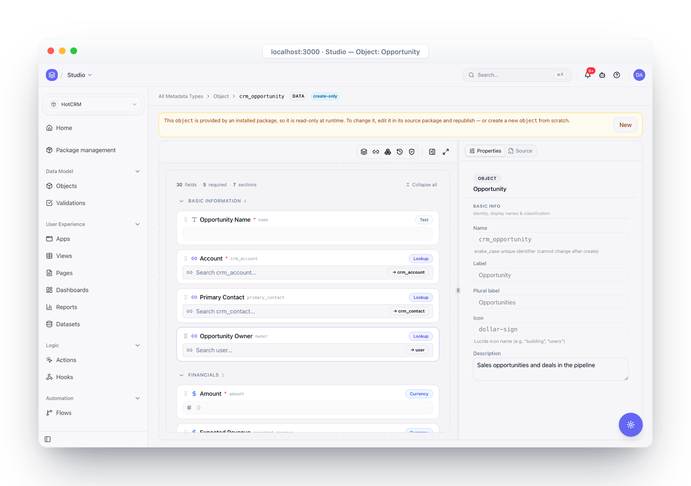
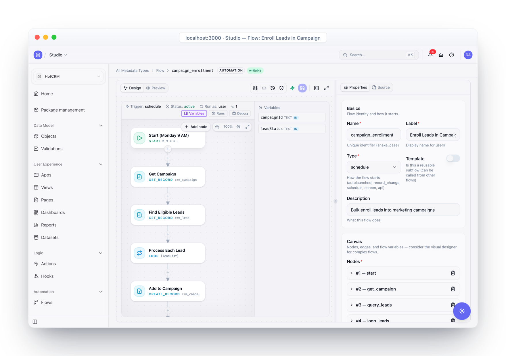

<div align="center">

# Object UI

**The Universal Schema-Driven UI Engine**

*From JSON to world-class UI in minutes*

[](LICENSE)
[](https://github.com/objectstack-ai/objectui/actions/workflows/ci.yml)
[](https://github.com/objectstack-ai/objectui/actions/workflows/codeql.yml)
[](https://www.typescriptlang.org/)
[](https://reactjs.org/)
[](https://tailwindcss.com/)

[**Documentation**](https://www.objectui.org) | [**Quick Start**](#quick-start) | [**Changelog**](./CHANGELOG.md) | [**Roadmap**](./ROADMAP.md)

</div>

---

## What is Object UI?

**Object UI is the View layer of the [ObjectStack](https://github.com/objectstack-ai/objectstack) ecosystem** — a standalone, schema-driven renderer that turns a JSON schema (or ObjectStack metadata) into production-grade React UI. Use it on its own with any backend, like Amis or Formily — or let it render ObjectStack apps end to end.

```
Describe  →  ObjectStack   the open-source protocol, toolkit & production runtime
Render    →  Object UI     this repo — JSON / metadata → React UI
Operate   →  ObjectOS      the commercial runtime environment (Cloud & Enterprise)
```

<p align="center">
  
  <br><sub>A JSON schema in, a production React UI out — no component code.</sub>
</p>

### See what it renders

One schema, many view types — dashboards, Gantt schedules, kanban boards, calendars — plus visual designers to build them without code.

<p align="center">
  
  
</p>
<p align="center">
  
  
</p>
<p align="center">
  
  
</p>
<p align="center"><sub><b>Dashboard, Gantt, Kanban, Calendar</b> rendered from metadata, plus <b>visual designers</b> for objects and flows — all from the plugin packages listed below.</sub></p>

## Examples

ObjectStack examples that demonstrate different features and use cases:

- **[examples/crm](examples/crm)** - Full-featured CRM application with dashboards, multiple views (Grid, Kanban, Map, Gantt), and custom server implementation.
- **[examples/todo](examples/todo)** - Simple task management app demonstrating basic ObjectStack configuration and field types.
- **[examples/kitchen-sink](examples/kitchen-sink)** - Comprehensive component catalog showing all available field types, dashboard widgets, and view types.
- **[examples/msw-todo](examples/msw-todo)** - Frontend-first development example using MSW (Mock Service Worker) to run ObjectStack in the browser.
- **[examples/byo-backend-console](examples/byo-backend-console)** ⭐ - Minimal custom console in ~100 lines showing third-party integration without full console infrastructure. Uses `@object-ui/app-shell` and `@object-ui/providers` with custom routing and a mock REST adapter (BYO backend).
- **[examples/console-starter](examples/console-starter)** - Opinionated, fork-ready console template with the full plugin set (grid, kanban, dashboard, designer, charts, …) wired up against an ObjectStack backend. Use this as the starting point when you want a complete console rather than a minimal integration.

### Running Examples as API Servers

All examples (except msw-todo) can be run as API servers using `@objectstack/cli`:

```bash
# From the monorepo root
pnpm run serve:crm          # Start CRM example on http://localhost:3000
pnpm run serve:todo         # Start Todo example on http://localhost:3000
pnpm run serve:kitchen-sink # Start Kitchen Sink example on http://localhost:3000

# Or from individual example directories
cd examples/crm
pnpm run serve
```

Each server provides:
- GraphQL API endpoint: `http://localhost:3000/graphql`
- REST API endpoints based on object definitions
- Sample data loaded from the configuration manifest

## 📦 For React Developers

### Option 1: Full Console (ObjectStack Backend)

Install the core packages to use `<SchemaRenderer>` inside your Next.js or Vite app with ObjectStack backend:

```bash
npm install @object-ui/react @object-ui/components @object-ui/data-objectstack
```

### Option 2: Minimal Integration (Any Backend) ⭐ **NEW!**

Use ObjectUI components without the full console infrastructure. Perfect for integrating into existing apps:

```bash
npm install @object-ui/app-shell @object-ui/providers
```

Then build your own console in ~100 lines:
```tsx
import { AppShell, ObjectRenderer } from '@object-ui/app-shell';
import { ThemeProvider, DataSourceProvider } from '@object-ui/providers';

function MyConsole() {
  return (
    <ThemeProvider>
      <DataSourceProvider dataSource={myAPI}>
        <AppShell sidebar={<MySidebar />}>
          <ObjectRenderer objectName="contact" />
        </AppShell>
      </DataSourceProvider>
    </ThemeProvider>
  );
}
```

**Benefits:**
- 🎯 **Lightweight**: ~50KB vs 500KB+ full console
- 🔌 **Any Backend**: REST, GraphQL, custom APIs (not just ObjectStack)
- 🎨 **Full Control**: Custom routing, auth, layouts
- 📦 **Cherry-pick**: Use only what you need

See [examples/byo-backend-console](examples/byo-backend-console) for a complete working example, or [examples/console-starter](examples/console-starter) if you want the full ObjectStack-bound console as a fork-ready template.

## Why Object UI?

### For You as a Developer

**Stop Writing Repetitive UI Code**
```tsx
// Traditional React: 200+ lines
function UserForm() {
  // ... useState, validation, handlers, JSX
}

// Object UI: 20 lines
const schema = {
  type: "crud",
  api: "/api/users",
  columns: [...]
}
```

**Better Performance, Smaller Bundle**
- Automatic code splitting
- Lazy-loaded components
- Zero runtime CSS overhead
- Optimized for production

**Full Control & Flexibility**
- Mix with existing React code
- Override any component
- Custom themes with Tailwind
- Export to standard React anytime

### vs Other Solutions

| Feature | Object UI | Amis | Formily | Material-UI |
|---------|-----------|------|---------|-------------|
| **Tailwind Native** | ✅ | ❌ | ❌ | ❌ |
| **Bundle Size** | 50KB | 300KB+ | 200KB+ | 500KB+ |
| **TypeScript** | ✅ Full | Partial | ✅ Full | ✅ Full |
| **Tree Shakable** | ✅ | ❌ | ⚠️ Partial | ⚠️ Partial |
| **Server Components** | ✅ | ❌ | ❌ | ⚠️ Coming |
| **Visual Designer** | ✅ | ✅ | ❌ | ❌ |

## Quick Start

### Option 1: Using CLI (Fastest Way) 🚀

The easiest way to get started is using the Object UI CLI:

```bash
# Install the CLI globally
npm install -g @object-ui/cli

# Create a new app from JSON schema
objectui init my-app

# Start the development server
cd my-app
objectui dev app.json
```

Your app will be running at http://localhost:3000! 🎉

Just edit `app.json` to build your UI - no React code needed.

### Option 2: Using as a Library

#### Installation

```bash
# Using npm
npm install @object-ui/react @object-ui/components

# Using yarn
yarn add @object-ui/react @object-ui/components

# Using pnpm
pnpm add @object-ui/react @object-ui/components
```

#### Basic Usage

```tsx
import React from 'react'
import { SchemaRenderer } from '@object-ui/react'
import { registerDefaultRenderers } from '@object-ui/components'

// Register default components once
registerDefaultRenderers()

const schema = {
  type: "page",
  title: "Dashboard",
  body: {
    type: "grid",
    columns: 3,
    items: [
      { type: "card", title: "Total Users", value: "${stats.users}" },
      { type: "card", title: "Revenue", value: "${stats.revenue}" },
      { type: "card", title: "Orders", value: "${stats.orders}" }
    ]
  }
}

function App() {
  const data = {
    stats: { users: 1234, revenue: "$56,789", orders: 432 }
  }
  
  return <SchemaRenderer schema={schema} data={data} />
}

export default App
```

### Copy-Paste Schema Examples

#### 📝 Contact Form

```json
{
  "type": "form",
  "title": "Contact Us",
  "fields": [
    { "name": "name", "type": "text", "label": "Full Name", "required": true },
    { "name": "email", "type": "email", "label": "Email", "required": true },
    { "name": "subject", "type": "select", "label": "Subject", "options": [
      { "label": "General Inquiry", "value": "general" },
      { "label": "Bug Report", "value": "bug" },
      { "label": "Feature Request", "value": "feature" }
    ]},
    { "name": "message", "type": "textarea", "label": "Message", "required": true }
  ],
  "actions": [{ "type": "submit", "label": "Send Message" }]
}
```

#### 📊 Data Grid

```json
{
  "type": "crud",
  "api": "/api/users",
  "columns": [
    { "name": "name", "label": "Name", "sortable": true },
    { "name": "email", "label": "Email" },
    { "name": "role", "label": "Role", "type": "select", "options": ["Admin", "User", "Viewer"] },
    { "name": "status", "label": "Status", "type": "badge" },
    { "name": "created_at", "label": "Joined", "type": "date" }
  ],
  "filters": [
    { "name": "role", "type": "select", "label": "Filter by Role" },
    { "name": "status", "type": "select", "label": "Filter by Status" }
  ],
  "showSearch": true,
  "showCreate": true,
  "showExport": true
}
```

#### 📈 Dashboard

```json
{
  "type": "dashboard",
  "title": "Sales Dashboard",
  "widgets": [
    { "type": "stat-card", "title": "Revenue", "value": "${stats.revenue}", "trend": "+12%", "w": 3, "h": 1 },
    { "type": "stat-card", "title": "Orders", "value": "${stats.orders}", "trend": "+8%", "w": 3, "h": 1 },
    { "type": "stat-card", "title": "Customers", "value": "${stats.customers}", "trend": "+5%", "w": 3, "h": 1 },
    { "type": "stat-card", "title": "Conversion", "value": "${stats.conversion}", "trend": "-2%", "w": 3, "h": 1 },
    { "type": "chart", "chartType": "line", "title": "Revenue Over Time", "w": 8, "h": 3 },
    { "type": "chart", "chartType": "pie", "title": "Sales by Region", "w": 4, "h": 3 }
  ]
}
```

#### 🔄 Kanban Board

```json
{
  "type": "kanban",
  "objectName": "tasks",
  "groupBy": "status",
  "titleField": "title",
  "cardFields": ["assignee", "priority", "due_date"],
  "columns": [
    { "value": "todo", "label": "To Do", "color": "#6366f1" },
    { "value": "in_progress", "label": "In Progress", "color": "#f59e0b" },
    { "value": "review", "label": "In Review", "color": "#3b82f6" },
    { "value": "done", "label": "Done", "color": "#22c55e" }
  ]
}
```

> 📖 **More examples:** See [examples/](./examples/) for complete working applications.

## 📦 Packages

Object UI is a modular monorepo with packages designed for specific use cases:

### Core Packages

| Package | Description | Size |
|---------|-------------|------|
| **[@object-ui/types](./packages/types)** | TypeScript definitions and protocol specs | 10KB |
| **[@object-ui/core](./packages/core)** | Core logic, validation, registry, expression evaluation | 20KB |
| **[@object-ui/react](./packages/react)** | React bindings and `SchemaRenderer` | 15KB |
| **[@object-ui/components](./packages/components)** | Standard UI components (Tailwind + Shadcn) | 50KB |
| **[@object-ui/fields](./packages/fields)** | Field renderers and registry | 12KB |
| **[@object-ui/layout](./packages/layout)** | Layout components with React Router integration | 18KB |

### CLI & Tools

| Package | Description | Size |
|---------|-------------|------|
| **[@object-ui/cli](./packages/cli)** | CLI tool for building apps from JSON schemas | 25KB |
| **[@object-ui/runner](./packages/runner)** | Universal application runner for testing schemas | 30KB |
| **[vscode-extension](./packages/vscode-extension)** | VSCode extension with IntelliSense and live preview | 32KB |

### Data Adapters

| Package | Description | Size |
|---------|-------------|------|
| **[@object-ui/data-objectstack](./packages/data-objectstack)** | ObjectStack data adapter | 8KB |

### Plugins (Lazy-Loaded)

| Plugin | Description | Size |
|--------|-------------|------|
| **[@object-ui/plugin-calendar](./packages/plugin-calendar)** | Calendar and event management | 25KB |
| **[@object-ui/plugin-charts](./packages/plugin-charts)** | Chart components powered by Recharts | 80KB |
| **[@object-ui/plugin-chatbot](./packages/plugin-chatbot)** | Chatbot interface components | 35KB |
| **[@object-ui/plugin-dashboard](./packages/plugin-dashboard)** | Dashboard layouts and widgets | 22KB |
| **[@object-ui/plugin-editor](./packages/plugin-editor)** | Rich text editor powered by Monaco | 120KB |
| **[@object-ui/plugin-form](./packages/plugin-form)** | Advanced form components | 28KB |
| **[@object-ui/plugin-gantt](./packages/plugin-gantt)** | Gantt chart visualization | 40KB |
| **[@object-ui/plugin-grid](./packages/plugin-grid)** | Advanced data grid | 45KB |
| **[@object-ui/plugin-kanban](./packages/plugin-kanban)** | Kanban boards with drag-and-drop | 100KB |
| **[@object-ui/plugin-map](./packages/plugin-map)** | Map visualization | 60KB |
| **[@object-ui/plugin-markdown](./packages/plugin-markdown)** | Markdown rendering | 30KB |
| **[@object-ui/plugin-timeline](./packages/plugin-timeline)** | Timeline components | 20KB |
| **[@object-ui/plugin-view](./packages/plugin-view)** | ObjectQL-integrated views (grid, form, detail) | 35KB |

## 🔌 Data Integration

Object UI is designed to work with any backend through its universal DataSource interface:

### ObjectStack Integration

```bash
npm install @object-ui/core
```

```typescript
import { createObjectStackAdapter } from '@object-ui/core';

const dataSource = createObjectStackAdapter({
  baseUrl: 'https://api.example.com',
  token: 'your-auth-token'
});

// Use with any component
<SchemaRenderer schema={schema} dataSource={dataSource} />
```

### Custom Data Sources

You can create adapters for any backend (REST, GraphQL, Firebase, etc.) by implementing the `DataSource` interface:

```typescript
import type { DataSource, QueryParams, QueryResult } from '@object-ui/types';

class MyCustomDataSource implements DataSource {
  async find(resource: string, params?: QueryParams): Promise<QueryResult> {
    // Your implementation
  }
  // ... other methods
}
```

[**Data Source Examples →**](./packages/types/examples/rest-data-source.ts)

## 🎯 What Can You Build?

Object UI is perfect for:

- ✅ **Admin Panels** - Complete CRUD interfaces in minutes
- ✅ **Dashboards** - Data visualization and analytics
- ✅ **Forms** - Complex multi-step forms with validation
- ✅ **CMS** - Content management systems
- ✅ **Internal Tools** - Business applications
- ✅ **Prototypes** - Rapid UI prototyping

## 🛣️ Roadmap

**Phase 1-2 (Q4 2025 - Q1 2026)** ✅ **COMPLETED**:
- ✅ Core schema rendering engine
- ✅ 40+ production-ready components (Shadcn + Tailwind)
- ✅ Expression system with field references
- ✅ Action system (AJAX, chaining, conditions)
- ✅ Theme system (light/dark mode)
- ✅ Report builder with exports
- ✅ Visual designer (beta)

**Phase 3 (Q1-Q2 2026)** ✅ **COMPLETED**:
- ✅ **Advanced Field Types**: Vector (AI embeddings), Grid (sub-tables), Formula, Summary
- ✅ **ObjectSchema Enhancements**: Inheritance, triggers, advanced permissions, metadata caching
- ✅ **QuerySchema AST**: SQL-like query building with joins, aggregations, subqueries
- ✅ **Advanced Filtering**: 40+ operators, date ranges, lookup filters, full-text search
- ✅ **Validation Engine**: 30+ rules, async validation, cross-field validation
- ✅ **DriverInterface**: Transactions, batch operations, connection pooling, query caching
- ✅ **DatasourceSchema**: Multi-datasource management, health monitoring

**Phase 4+ (Q2-Q4 2026)**:
- 🔄 Real-time collaboration features
- 🔄 Mobile-optimized components
- 🔄 AI-powered schema generation
- 🔄 Advanced workflow automation

See [ROADMAP.md](./ROADMAP.md) for the complete development roadmap.

## 🤝 Contributing

We welcome contributions! Please read our [Contributing Guide](./CONTRIBUTING.md) for details.

### For Developers

- 📖 [Contributing Guide](./CONTRIBUTING.md) — How to contribute to the project
- 🏗️ [Architecture Overview](https://www.objectui.org/docs/guide/architecture-overview) — Package topology and boundaries
- 🔄 [ObjectStack Spec](https://github.com/objectstack-ai/spec) — The underlying protocol this project implements
- 🗺️ [Roadmap](./ROADMAP.md) — Current status and upcoming milestones

### Development Setup

**Quick Setup (Recommended):**
```bash
# Clone the repository
git clone https://github.com/objectstack-ai/objectui.git
cd objectui

# Run automated setup script
./scripts/setup.sh
```

**Manual Setup:**
```bash
# Clone the repository
git clone https://github.com/objectstack-ai/objectui.git
cd objectui

# Install dependencies
pnpm install

# Build all packages
pnpm build

# Run the development site
pnpm dev

# Run tests
pnpm test
```

## 📄 License

Object UI is [MIT licensed](./LICENSE).

## 🌟 Community & Support

- ⭐ [Star on GitHub](https://github.com/objectstack-ai/objectui) - Show your support!
- 📖 [Documentation](https://www.objectui.org) - Comprehensive guides and API reference
- 🐛 [Report Issues](https://github.com/objectstack-ai/objectui/issues) - Found a bug? Let us know
- 📧 [Email Us](mailto:hello@objectui.org) - Get in touch
- 🧠 **Agent skill** — `npx skills add objectstack-ai/objectui` installs an Object UI skill for Claude Code, Cursor, Copilot, and more

## 🙏 Acknowledgments

Object UI is inspired by and builds upon ideas from:
- [Amis](https://github.com/baidu/amis) - Schema-driven UI framework
- [Formily](https://github.com/alibaba/formily) - Form solution
- [Shadcn/UI](https://ui.shadcn.com/) - UI component library
- [Tailwind CSS](https://tailwindcss.com/) - Utility-first CSS framework

---

<div align="center">

**Built with ❤️ by the [ObjectQL Team](https://github.com/objectql)**

[Website](https://www.objectui.org) · [Documentation](https://www.objectui.org) · [GitHub](https://github.com/objectstack-ai/objectui)

</div>
