# Browser verification — Gantt Phases 1–5

Automated end-to-end verification of the Gantt plugin in a real Chromium
browser, driven by [`scripts/verify-browser.mjs`](../../scripts/verify-browser.mjs)
against the demo app ([`demo/`](../../demo/)). The script asserts behavior via
the DOM and persists the screenshots in this directory; `results.json` holds
the machine-readable outcome of the latest run.

Run it with the demo server up:

```sh
pnpm --dir packages/plugin-gantt exec vite demo --port 5199
node packages/plugin-gantt/scripts/verify-browser.mjs
```

## Latest run: 22/22 checks passed

### 1. Hierarchy, milestones, dependency links

- 13 tree rows (3 summary groups + 8 tasks + 2 milestones), 3 solid summary
  bars (title + rollup progress fill), 2 milestone diamonds.
- 10 dependency arrows covering **all four link types** (`fs`, `ss`, `ff`,
  `sf`), plus the red Today line and both custom markers (Sprint 2,
  Code freeze).
- 
- 
- **Fit-to-width (zoom to fit):** a short date span in week / month / quarter
  mode would otherwise leave the grid much narrower than the timeline area (a
  blank right-side gap). Rather than pad the calendar with empty units — which
  in month mode means *years* of blank columns to reach the right edge, the
  approach we backed out — the **column width stretches** so the project's real
  span fills the viewport. The calendar keeps its natural extent (e.g. a
  2.5-month project shows ~4 month columns, not 30), a manual zoom overrides it,
  and a long project that already overflows keeps the base width and scrolls.
  Asserted in week mode (fills the viewport AND ≤ 24 columns) and month mode
  (≤ 8 columns, no trailing empty months, still fills).

### 2. Collapse / expand

- Collapsing the *Build* summary hides its 4 child rows (13 → 9) and the
  links into the subtree (10 → 4); expanding restores all 13 rows.
- 

### 3. Hover tooltip + link highlight

- Hovering *Backend services* shows the tooltip with its configured
  `tooltipFields` (`Owner · Priya N. · Status · In Progress · Effort · 15 days`)
  and highlights exactly its 2 links (t3→t4, t4→t6).
- 

### 4. Drag-to-create dependency

- A real mouse drag from the link dot of *Documentation* onto *Frontend app*
  shows the dashed rubber band mid-drag; dropping creates the new `t8 → t5`
  arrow.
- 
- 

### 4b. Pixel-level arrow geometry audit

[`scripts/audit-geometry.mjs`](../../scripts/audit-geometry.mjs) parses every
arrow's SVG path and measures its endpoints against the live DOM rects of the
source/target bars, across three scenarios (project fixture in day and week
mode, plus a `?edge=1` fixture with backward links of every type, links into
summary rows, and milestone→milestone chains). **All 29 measured endpoints are
within ±0.4 px** of the expected anchors:

- task bars: edge × vertical center (bars carry explicit inline `top`/`height`
  so they are exactly row-centered),
- milestones: the diamond's visual tip (half a diagonal out from center),
- summary rows: the solid summary bar's own center (row-centered, slightly
  slimmer than task bars).

Zoomed clips of each arrow's target anchor are saved under
[`geometry/`](geometry/), e.g. an `fs` arrow meeting a milestone tip:


### 4c. Summary group drag + parent rollup on child drag

[`scripts/verify-group-drag.mjs`](../../scripts/verify-group-drag.mjs) drives
real mouse drags in week mode (5/5 checks passed):

- Dragging the *Build* summary bar moves the **whole subtree**: mid-drag
  every child bar preview-shifts with the summary and a date chip shows the
  new range; on drop all 5 tasks commit exactly +14 days with durations and
  internal spacing preserved.
- Dragging the *Integration* child +7 days past the parent's end stretches
  the summary bar via rollup — parent start stays pinned to the earliest
  child, parent end follows the moved child.
- 
- 
- 

### 4d. Configurable hover tooltip (悬浮详情 / `tooltipFields`)

The tooltip is now dynamically configurable like the component's other
field-bound properties. A view declares `tooltipFields` on its gantt config
(field names, or `{ field, label }` to override the label); ObjectGantt
resolves each against the record — select options → their label, lookups →
the embedded record name, dates/numbers/currency/percent through the shared
`@object-ui/fields` formatters — and feeds them to `GanttView` as
`task.fields`. When present they replace the default
start → end · duration · progress line; when unconfigured the default line
is kept.

[`scripts/verify-tooltip-fields.mjs`](../../scripts/verify-tooltip-fields.mjs)
hovers *Backend services* (configured with Owner / Status / Effort) and
asserts the tooltip renders those label/value rows instead of the date line
(6/6 checks passed):

- 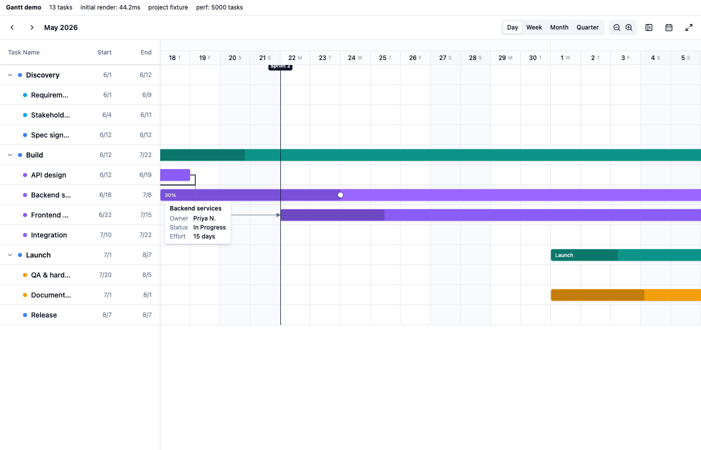

### 4e. Live parent stretch on child drag

When a child task is dragged past its parent's current extent, the parent
summary bar now re-rolls and stretches **in real time during the drag**, not
just on drop — matching the rollup that commits when the pointer is released.
Every ancestor summary of the dragged task stretches; the parent's pinned edge
(earliest child) stays put, so it grows rather than shifts.

[`scripts/verify-child-stretch.mjs`](../../scripts/verify-child-stretch.mjs)
drags *Backend services* three weeks right (new end Jul 29, overshooting the
Build group's Jul 22 edge) and asserts, mid-drag, that the p2 bar widens ~7d
with its left edge pinned, then stays widened after drop with no flicker
(4/4 checks passed):

- 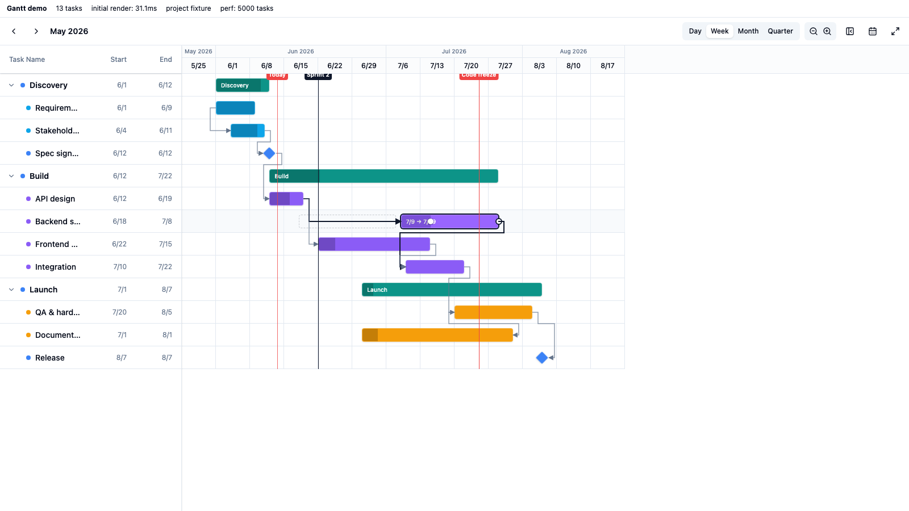
- 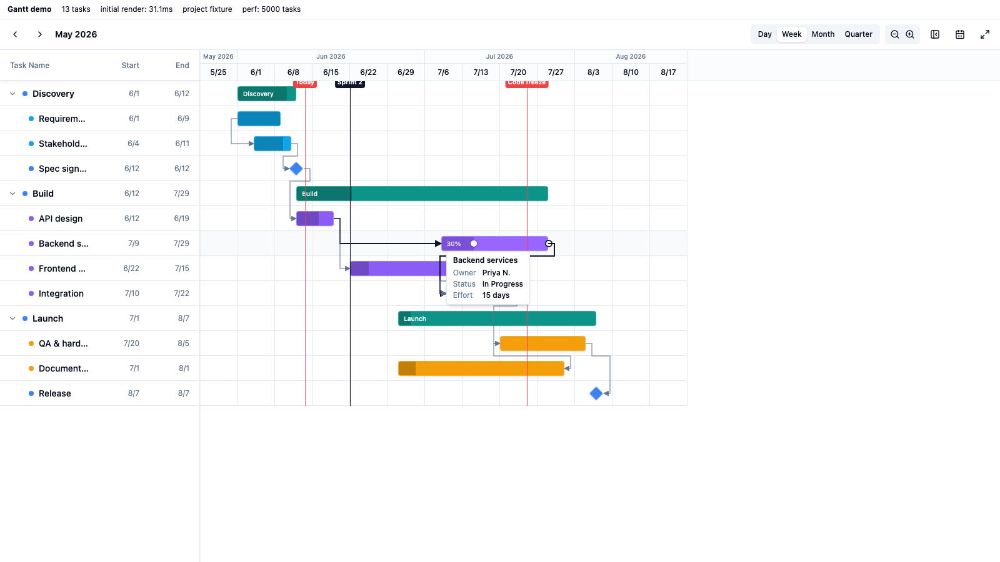

### 5. Performance — 5,000 tasks (`?perf=5000&mode=week`)

| Metric | Result |
| --- | --- |
| Initial render (5,000 tasks) | **27 ms** |
| Rows in the DOM | **26** of 5,000 |
| Week columns in the DOM | **26** |
| Window shift after jumping to the middle of the list | **40.5 ms** |
| Rows in the DOM after the jump | 32 |

- 
- 

### 6. Performance — 10,000 tasks (`?perf=10000`)

[`scripts/perf-10k.mjs`](../../scripts/perf-10k.mjs) runs a heavier stress
suite against `?perf=10000&mode=week` (1,000 summary groups × 10 chained
tasks) and persists [`perf-10000-metrics.json`](perf-10000-metrics.json):

| Metric | Result |
| --- | --- |
| Initial render (10,000 tasks) | **59.2 ms** |
| Rows / DOM nodes in the document | **26 rows / 674 nodes** (virtualized) |
| Deep jump to 25 / 50 / 75 / 100% of ~400k px scroll height | 30.4 / 29.3 / 29.3 / **28.5 ms** |
| Sustained vertical scroll, 120 frames × 300 px | avg **17.2 ms** (~58 fps), p95 21.3 ms, max 28.9 ms |
| Horizontal scroll, 60 frames × 200 px | avg **16.7 ms**, max 27.9 ms |
| View-mode switch week→month / month→week | 120 ms / 67 ms |
| Collapse a summary group | 80 ms |
| Hover → tooltip visible | 62 ms |
| JS heap | 141 MB |

Every frame stays under the 33 ms (30 fps) jank threshold; the average sits at
the 60 fps budget. DOM size is independent of task count, so scrolling cost is
flat from 1k to 10k rows.

- 
- 
- 

---

# Phase 6 — critical path, auto-schedule, export PNG

Driven by [`scripts/verify-phase6.mjs`](../../scripts/verify-phase6.mjs)
against the demo (`?critical=1` starts the highlight on). All three features
are pure additions — read-only display (critical path), an explicit one-shot
action (auto-schedule), and a client-side raster (export). The underlying
graph maths live in [`src/scheduling.ts`](../../src/scheduling.ts) and are
unit-tested in [`src/scheduling.test.ts`](../../src/scheduling.test.ts)
(12 cases).

Run it with the demo server up:

```sh
pnpm --dir packages/plugin-gantt exec vite demo --port 5199
node packages/plugin-gantt/scripts/verify-phase6.mjs
```

## Latest run: 16/16 checks passed

### 1. Critical path (CPM)

A toolbar toggle (Activity icon) runs a forward/backward CPM pass over the
dependency graph and highlights the zero-slack chain in red — task bars,
milestones, summary bars and the joining link arrows.

- The long leg **t1 → t2 → m1 → t3 → t5 → t6 → t7 → t8** is critical.
- The diamond's parallel legs prove the maths: **t5** (Frontend, 23d) is
  critical while **t4** (Backend, 20d) — which shares predecessor t3 and
  successor t6 — is *not*, because its slack is non-zero.
- Toggling off clears every `data-critical` flag.
- 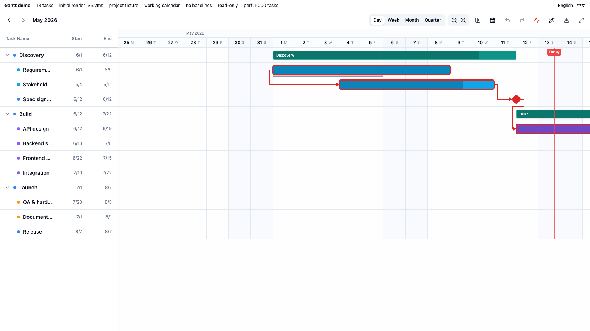

### 2. Auto-schedule (顺延)

A toolbar button (Wand2 icon, shown only when `onTaskUpdate` is wired) runs a
one-shot dependency reschedule: each task is pushed as late as its links
require, durations preserved, never pulled earlier. On the fixture this shifts
**t4, t6, t7** later to clear their finish-to-start overlaps, cascading down
the chain; summary (parent) bars are left as derived rollups.

- 

### 3. Export PNG

A toolbar button (Download icon) rebuilds the **whole** chart (every row,
unaffected by row virtualization) into a standalone SVG using concrete hex
colors — the prebuilt theme CSS vars don't resolve in a detached SVG — then
rasterizes it to a 2× PNG via a canvas and downloads `gantt-<mode>.png`.
Zero third-party dependencies.

- The latest run produced a valid SVG (0 NaN coordinates) rasterized to an
  **11920×1112** `gantt-day.png` (~360 KB).
- The export carries the **same information the live chart shows**:
  - the **two-row header** (month/year group band over the day/week/… unit
    labels) — earlier the export drew only the unit row, so the downloaded
    image had no month/year context;
  - the planned **baseline strips** (`t1`/`t4`/`t5`);
  - the custom vertical **markers** with labels (Sprint 2 + Code freeze).
  All three are asserted in the export SVG (3 baseline fills, both marker
  labels, and a 4-digit year from the group band). Earlier the export omitted
  the month band, baselines and markers; those gaps are now closed.

---

## Phase 6.2 — Baselines · Working calendar · Undo/redo

Driven by [`scripts/verify-phase6b.mjs`](../../scripts/verify-phase6b.mjs)
against the demo. The scheduling maths (working-day reschedule + critical
path) live in [`src/scheduling.ts`](../../src/scheduling.ts), unit-tested in
[`src/scheduling.test.ts`](../../src/scheduling.test.ts) (working-calendar
block added). Undo/redo and baseline rendering are in
[`src/GanttView.tsx`](../../src/GanttView.tsx).

Run it with the demo server up:

```sh
pnpm --dir packages/plugin-gantt exec vite demo --port 5199
node packages/plugin-gantt/scripts/verify-phase6b.mjs
```

## Latest run: 22/22 checks passed

### 1. Baselines (planned vs actual)

Tasks carrying `baselineStart` / `baselineEnd` render a thin slate reference
strip hugging the row bottom, beneath the live bar — for summary, task and
milestone rows alike. `showBaselines` (default on; `?baselines=0` to hide)
gates them; `ObjectGantt` maps them from `baselineStartField` /
`baselineEndField`.

- The fixture plants baselines on **t1, t4, t5**.
- **t4** (Backend) slipped: its planned baseline ends Jul 2 while the live bar
  runs to Jul 8 — the strip is visibly shorter than and offset from the bar
  (verified by geometry: baseline end < bar end).
- `?baselines=0` removes every strip.
- 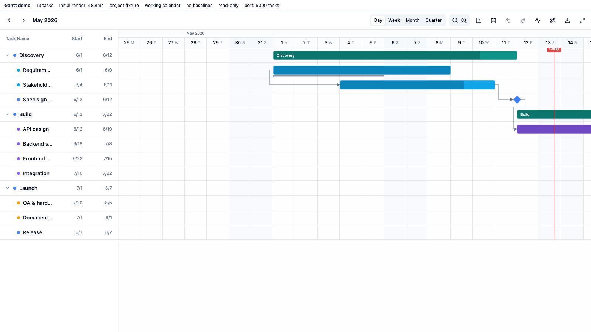

### 2. Working calendar

`workingCalendar` (`?cal=1` → `{ skipWeekends: true }`) measures durations in
working days and snaps rescheduled tasks to working-day boundaries. After
auto-scheduling under the calendar, **no leaf task starts on a Saturday or
Sunday**, and the resulting schedule differs from the calendar-off run on the
same fixture (e.g. t5 lands Jun 22→Jun 23, t7 Jul 26→Jul 24, Release Aug
11→Aug 10).

- 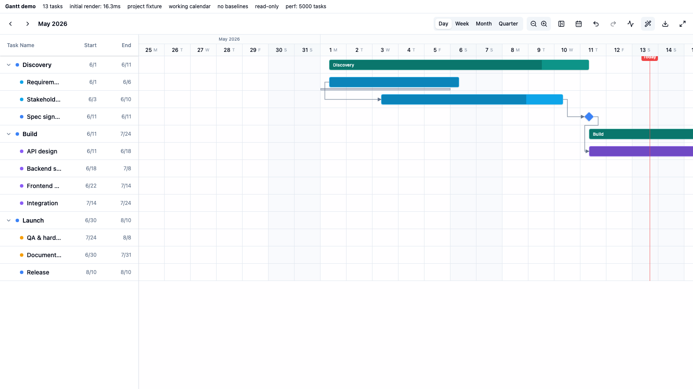

### 3. Undo/redo

`commitTaskUpdates` records before/after field deltas for every drag / inline
edit / auto-schedule (group drags batched into one entry) and replays them
through `onTaskUpdate`. Toolbar Undo/Redo buttons appear only when
`onTaskUpdate` is wired; Ctrl/Cmd+Z, Ctrl/Cmd+Shift+Z and Ctrl/Cmd+Y also
drive history.

- Both buttons start disabled. Dragging **t4** two columns right enables Undo.
- Toolbar **Undo** returns t4 to its exact origin (px-identical) and enables
  Redo; with the only entry undone, Undo disables again.
- Keyboard **Ctrl+Y** re-applies the drag; **Ctrl+Z** restores the origin.
- 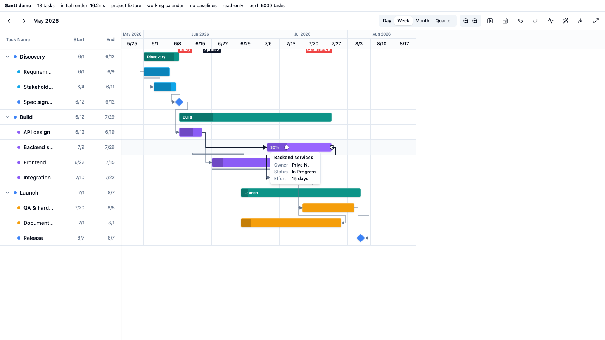
- 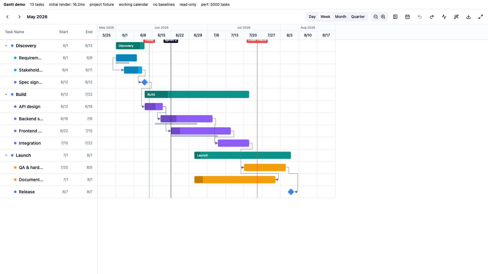

### 4. Read-only mode (`readOnly` / `?readonly=1`)

An explicit `readOnly` prop on `GanttView` (mapped from the view schema's
top-level `readOnly` by `ObjectGantt`) disables **every** write interaction in
one place, regardless of which callbacks are wired. Internally each write prop
is prop-shadowed (`onTaskUpdate`, `onTaskDelete`, `onDependencyCreate`,
`onTaskReorder`, `inlineEdit`, `autoSchedule` are forced to `undefined`/`false`
when `readOnly` is set), so bar drag / resize / progress handles, inline edit,
the right-click Edit/Delete items, dependency-link drag, row reorder,
auto-schedule, and the Undo/Redo toolbar buttons all drop out together.
Non-mutating affordances stay live — task click, view-mode switch, zoom,
list collapse, critical-path highlight, export PNG, fullscreen.

The demo passes the prop through `?readonly=1` and a unit suite
([`src/GanttView.dnd.test.tsx`](../../src/GanttView.dnd.test.tsx)) asserts that
passing all the write callbacks **and** `readOnly` still renders no resize /
progress handles, a bar-body drag does not call `onTaskUpdate`, and the
Undo/Redo/auto-schedule buttons are absent.

[`scripts/verify-phase6b.mjs`](../../scripts/verify-phase6b.mjs) loads
`?readonly=1` in week mode (6/6 checks passed):

- Bars, baselines, dependency arrows, milestones and markers all still render.
- **0** resize handles and **0** progress handles across the chart.
- The Undo/Redo arrows and the auto-schedule wand are absent from the toolbar.
- A real mouse drag on **t4** leaves it pixel-identical — no write fires.
- 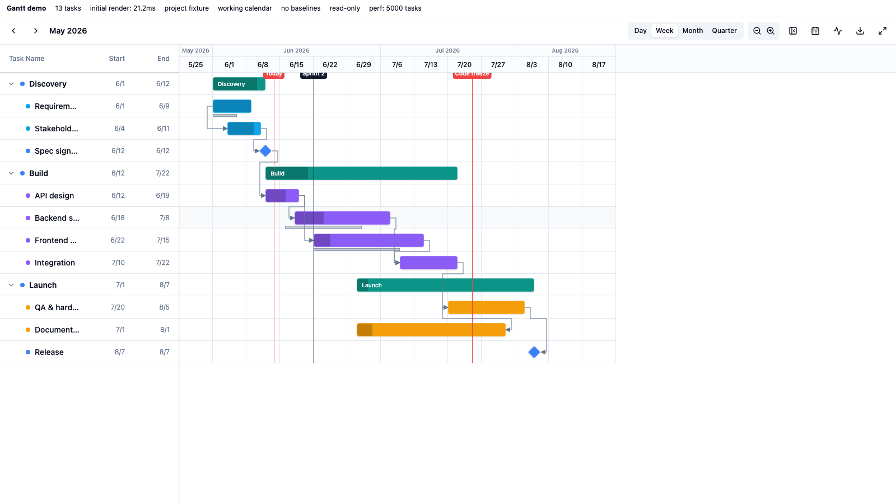

---

## i18n — fully localized chrome + dates (`?lang=en` / `?lang=zh`)

Driven by [`scripts/verify-i18n.mjs`](../../scripts/verify-i18n.mjs) against the
demo, which wraps the chart in an `I18nProvider` and exposes an `English · 中文`
toggle (`?lang=en` / `?lang=zh`).

Two fixes landed here:

1. **Dates follow the i18n language, not the browser locale.** `GanttView`
   threads the provider's `language` into every user-facing `toLocaleDateString`
   (header bands, unit labels, tooltips, edit chips) via a `dateLocale`. Before
   this the chrome could be English while the calendar rendered Chinese dates
   (the browser was `zh-CN`) — now they always match.
2. **The central locale packs were completed.** `@object-ui/i18n`'s built-in
   `gantt:` namespace ([`en.ts`](../../../i18n/src/locales/en.ts),
   [`zh.ts`](../../../i18n/src/locales/zh.ts)) was stale — it predated Phases
   4–6, so apps on `I18nProvider` rendered **raw keys** (e.g.
   `gantt.viewMode.day`, `gantt.toolbar.criticalPath`) for the newer
   toolbar / view-mode / menu strings. The namespace now mirrors the plugin's
   complete `GANTT_DEFAULT_TRANSLATIONS`; other locales degrade gracefully to
   English via `fallbackLng`.

The script asserts, in both languages, that **no `gantt.*` key leaks** into any
button title, view-mode tab, or column header, and that the Phase-6 toolbar
strings (critical path, auto-schedule, export, undo/redo) are translated
(13/13 checks passed):

- **English** — chrome and dates both English (`Day/Week/Month/Quarter`,
  `Task Name/Start/End`, `May 2026`).
- 
- **Chinese** — chrome and dates both Chinese (`日/周/月/季`,
  `任务名称/开始/结束`, `2026年5月`, weekday `一/二/三`).
- 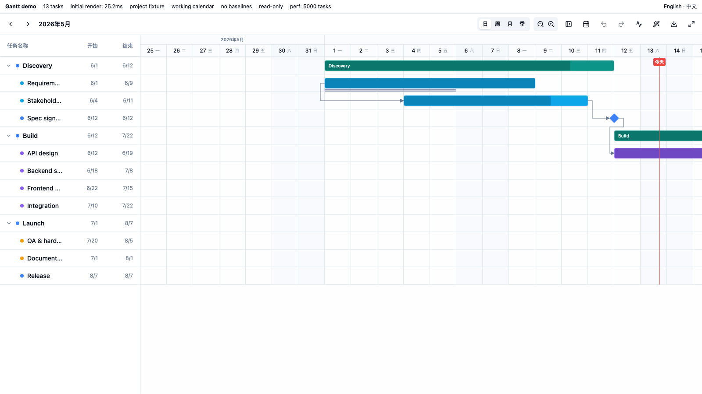

---

## Dynamic Group by (动态 Group by) (`?group=owner` / `?group=status`)

Driven by [`scripts/verify-groupby.mjs`](../../scripts/verify-groupby.mjs)
against the demo's `group: owner` / `group: status` toolbar links.

`GanttView` takes a `groupBy(task) => { key, label } | null` accessor. When set,
leaf tasks are bucketed by `key` and rendered beneath **one synthesized summary
row per group** — the original `parent` hierarchy is replaced by the grouping,
and the existing rollup/collapse/summary machinery renders the buckets for free.
It is a purely presentational transform: the timeline range, critical path and
auto-schedule still read the real task list, and the synthetic group rows carry
`data.__group` so they are never draggable. `ObjectGantt` exposes this as a
`groupByField` config key (select options / lookups resolve to their label).

The script asserts (6/6 checks passed):

- **Group by owner** — three owner summary rows synthesized
  (`Sam K. / Lee W. / Priya N.`), the original phase summaries (`p1/p2/p3`) are
  gone, all eight leaf tasks render once, and collapsing a group hides its
  members (8 → 5 bars). Cross-group dependency links still route correctly.
- 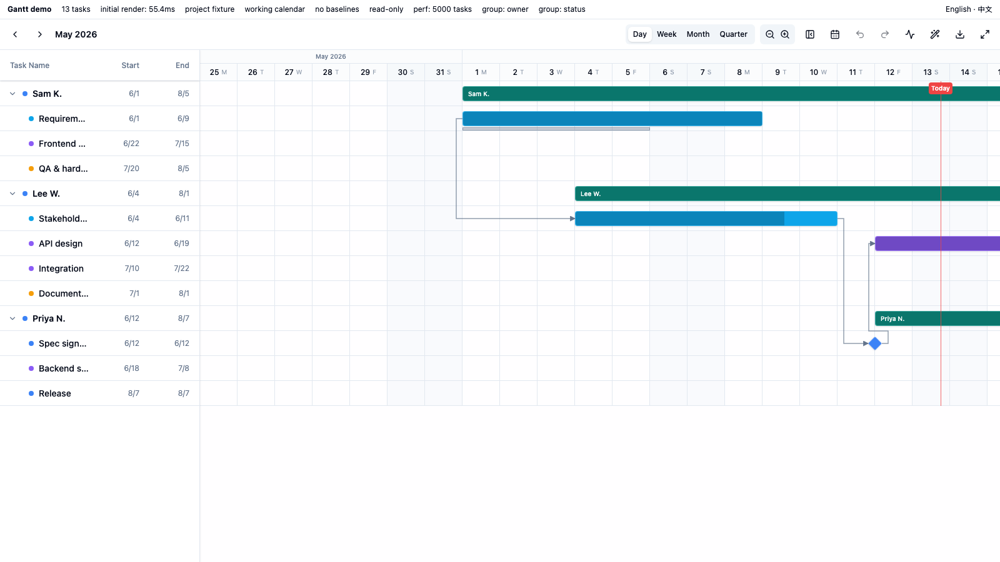
- **Group by status** — three status summary rows (`Todo / In Progress / Done`),
  original hierarchy replaced.
- 

## Resource / Workload view (资源/工作负载视图) (`?resource=owner` / `?resource=status`)

Driven by [`scripts/verify-resource.mjs`](../../scripts/verify-resource.mjs)
against the demo's `resource: owner` / `resource: status` toolbar links.

`ResourceWorkload` is a standalone view (not the Gantt grid): one row per
resource, each drawing a load histogram aligned to the same time columns. For a
resource `R` and column `C`, `load(R,C) = Σ effort(task)` over `R`'s tasks
overlapping `C`; a column is **over-allocated** (painted red) once its load
exceeds the resource's capacity. The pure aggregation lives in
[`workload.ts`](../../src/workload.ts) (7 unit tests) and the renderer in
[`ResourceWorkload.tsx`](../../src/ResourceWorkload.tsx) (5 render tests). The
left caption surfaces each resource's peak load and over-allocated column count;
a dashed line marks the capacity ceiling. `ObjectGantt` exposes it via
`resourceView` + `assigneeField` / `effortField` / `capacity`.

The script asserts (5/5 checks passed):

- **Resource by owner** — three resource rows (`Priya N. / Sam K. / Lee W.`),
  204 histogram cells, 44 columns flagged over-allocated, and the peak caption
  (`Peak: 2 / 1 · N overloaded`) flags every double-booked rep. The bars in any
  overlapping span turn red.
- 
- **Resource by status** — three status rows (`Todo / In Progress / Done`),
  same histogram + overload model.
- 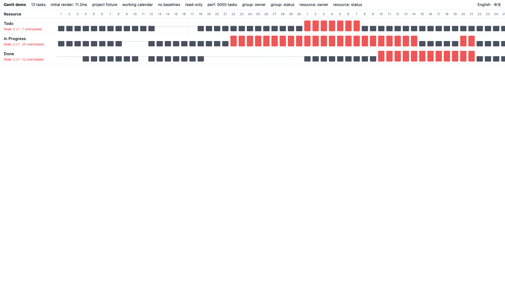
- **Fully localized** — `?lang=zh` resolves the whole view (`资源` / `峰值` /
  `超载`) via the central i18n packs.
- 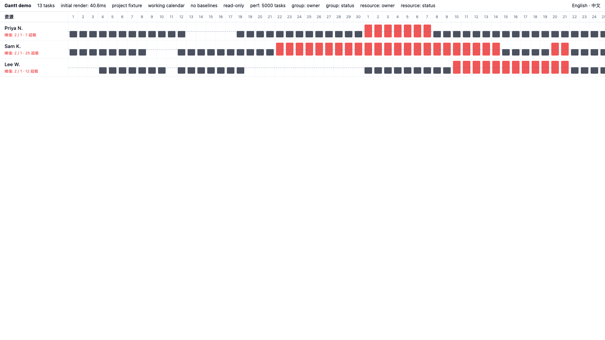

## Non-linear working-time axis (非线性工作时间轴) (`?cal=1`)

Driven by [`scripts/verify-workaxis.mjs`](../../scripts/verify-workaxis.mjs)
against the demo's `working calendar` toolbar link.

In **day mode**, when a `workingCalendar` marks weekends (`skipWeekends`) or
explicit `holidays` as non-working, those columns are **folded out of the grid**
entirely — Friday sits directly against Monday, so the timeline shows only
working time. This makes the date→px mapping non-linear (a weekend spans zero
pixels), so all positioning (bars, dependency arrows, milestones, the Today
line, custom markers) is routed through a single `dateToX` / `xToDate` pair that
interpolates within the owning column. Drag/resize advance by **working
columns** (a one-column drag from Friday lands on Monday). Coarser scales
(week / month / quarter) and the no-calendar case keep the plain linear axis
unchanged — `dateToX` is algebraically identical there. The fold logic has 7
unit tests in [`GanttView.workaxis.test.tsx`](../../src/GanttView.workaxis.test.tsx).

The script asserts (5/5 checks passed):

- **Linear axis** (`?mode=day`, no calendar) — every calendar day renders; no
  Friday→Monday day-number jumps.
- 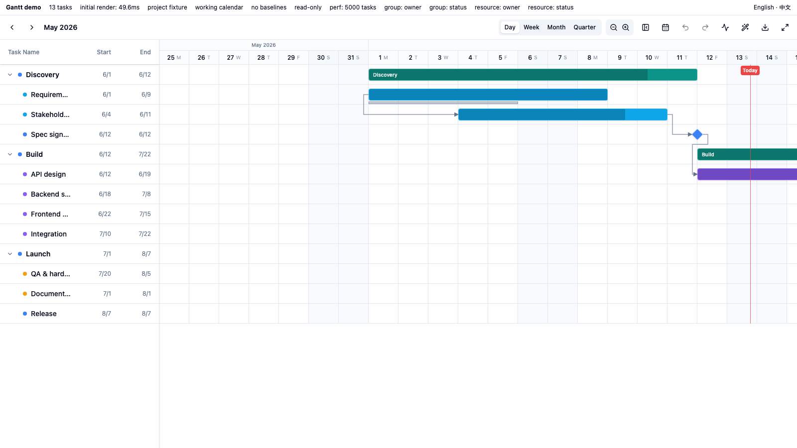
- **Folded axis** (`?cal=1`) — weekend columns are dropped; the header reads
  `… 29F · 1M …`, `… 5F · 8M …` (four Fri→Mon skips), and every bar, arrow,
  milestone, Today line, and marker re-aligns to the compressed grid.
- 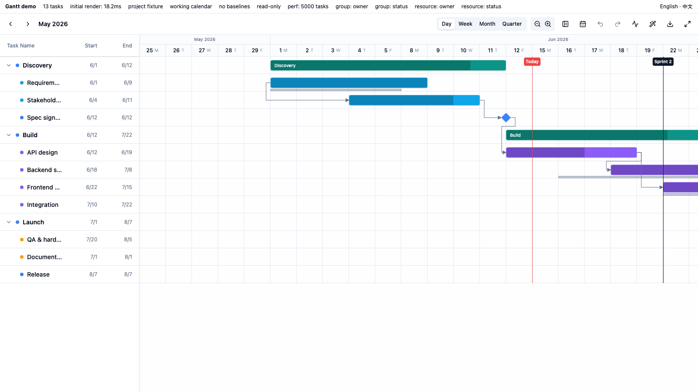
- **Folded + localized** — `?cal=1&lang=zh` folds identically with Chinese
  chrome.
- 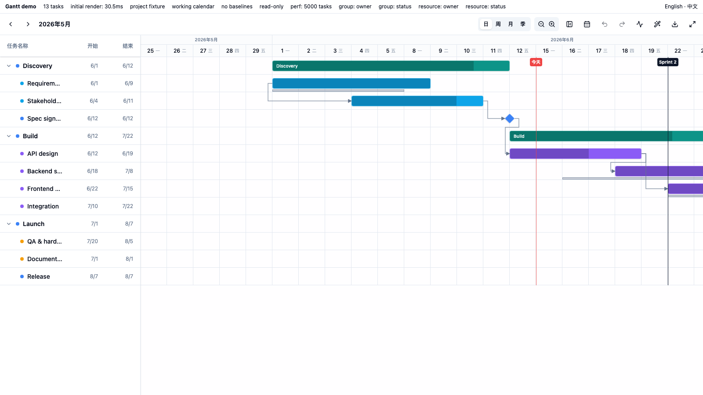

## Quick filter (快速筛选) (`?quickfilter=1`)

Driven by [`scripts/verify-quickfilter.mjs`](../../scripts/verify-quickfilter.mjs)
against a real `ObjectGantt` wired to a mock 排产计划 (production-scheduling) data
source — eight plan tasks plus a reference object the `项目` lookup pulls from.
The bar renders one multi-select dropdown per configured dimension; selecting
options narrows the visible task bars (AND across dimensions) and, by default,
auto-zooms the timeline to the remaining span. Twenty-three unit tests back the
wiring ([`QuickFilterBar.test.tsx`](../../src/QuickFilterBar.test.tsx) +
[`ObjectGantt.quickfilter.test.tsx`](../../src/ObjectGantt.quickfilter.test.tsx)).

The script asserts (9/9 checks passed):

- **Filter bar** — one dropdown per configured dimension (项目 / 产品 / 状态 /
  派工类别 / 管理责任人); all 8 plan tasks visible before filtering.
- 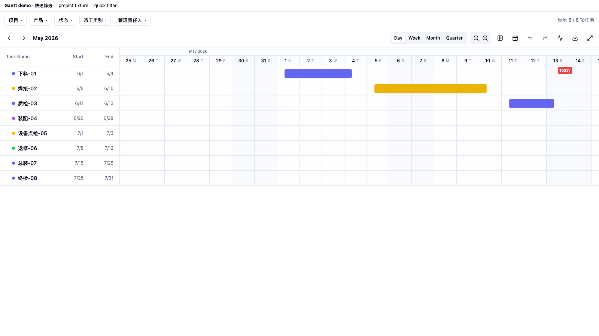
- **Lookup full domain** — `项目` resolves the whole referenced object list,
  including `项目C（暂无任务）` which has **no** tasks but still appears as an option.
- 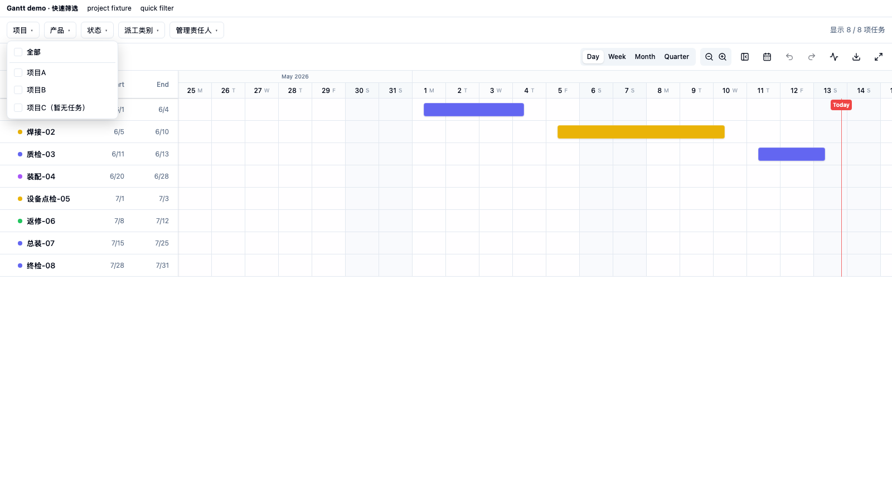
- **Single-dimension filter** — picking 项目A narrows to that project's 4 tasks.
- 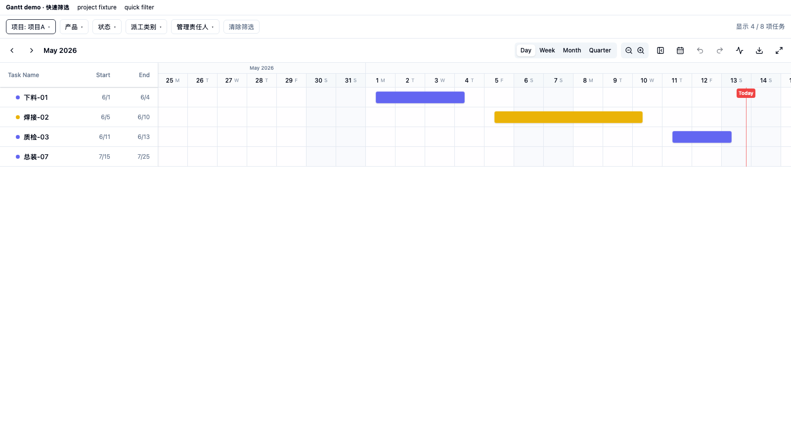
- **AND across dimensions** — 项目A **+** 状态=待开始 → 3 tasks (the schema's
  4 status options resolve in full; the doing/done tasks drop out).
- 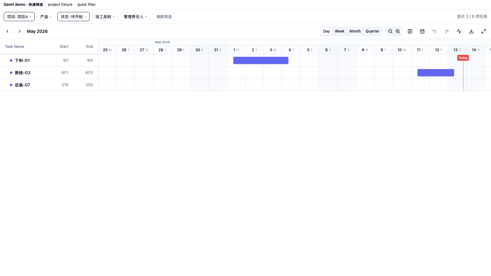
- **Clear** — the 清除筛选 button restores all 8 tasks and the full axis.
- 
- **Auto-zoom** — 状态=已完成 narrows to the single done task (返修-06); the
  timeline re-derives from that one task, so the track shrinks from `4920px` to
  `1560px` (fills the viewport instead of scrolling) and the header rescales to
  early July.
- 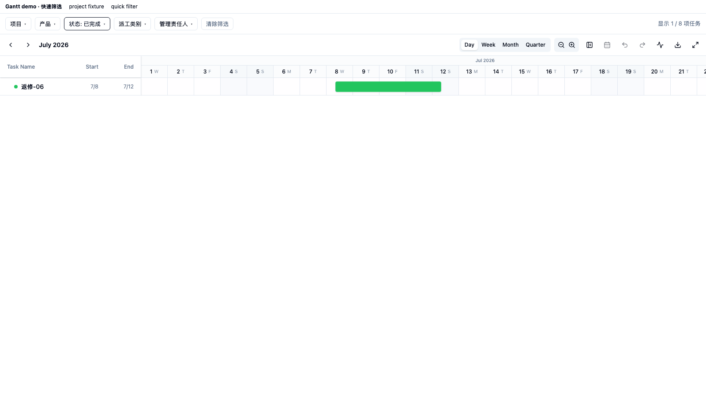

## Dependency edit — 依赖增删 + 类型选择 (`?` project fixture)

Driven by [`scripts/verify-dep-edit.mjs`](../../scripts/verify-dep-edit.mjs)
against the project fixture (`?lang=zh`), where t4 "Backend services" depends on
t3 "API design" (a FS link). When dependency editing is enabled an invisible,
wide hit-path is laid over every link (`pointer-events: stroke` overrides the
overlay svg's `pointer-events: none`), so a link is right-clickable without
stealing bar drag/click. Fourteen unit tests back the interaction + writeback
([`GanttView.interactions.test.tsx`](../../src/GanttView.interactions.test.tsx) +
[`ObjectGantt.test.tsx`](../../src/ObjectGantt.test.tsx)).

The script asserts (7/7 checks passed):

- **Link menu** — right-clicking the t3 → t4 link opens a menu titled
  `API design → Backend services` with the four link types (完成→开始 FS /
  开始→开始 SS / 完成→完成 FF / 开始→完成 SF, the current one ✓-checked) and a red
  移除依赖.
- 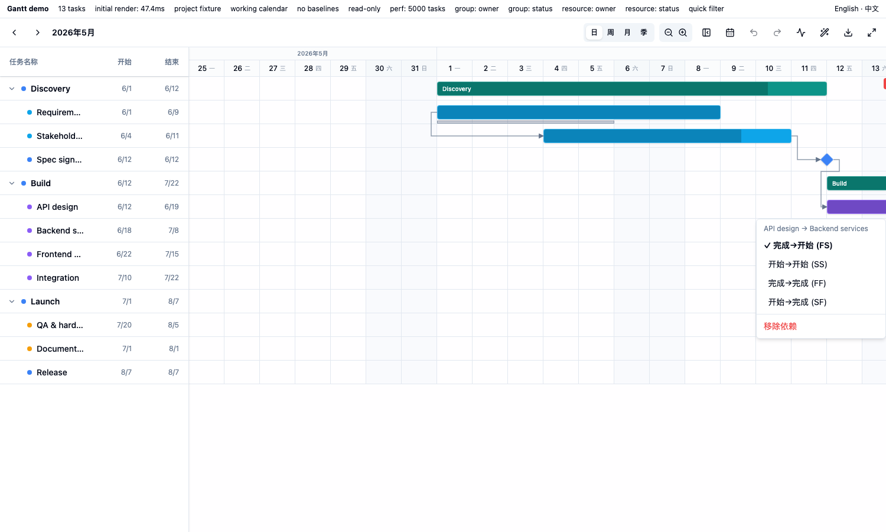
- **类型选择** — choosing 开始→开始 (SS) re-renders the link with
  `data-link-type="ss"` (ObjectGantt upserts the link's type, promoting the
  field to object-array form so the type round-trips).
- 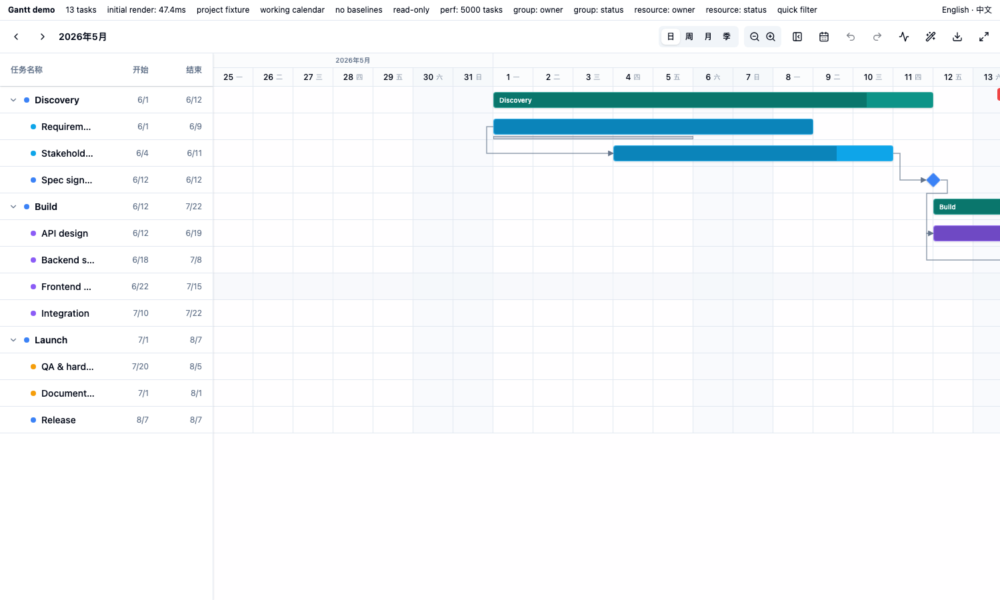
- **依赖删** — re-opening the menu and clicking 移除依赖 drops the link entirely.
- 
- **依赖增 (添加紧前)** — right-clicking the t4 bar exposes 添加紧前依赖 /
  添加紧后依赖; the predecessor picker re-offers t3 (now unlinked), and picking it
  re-creates the FS link.
- 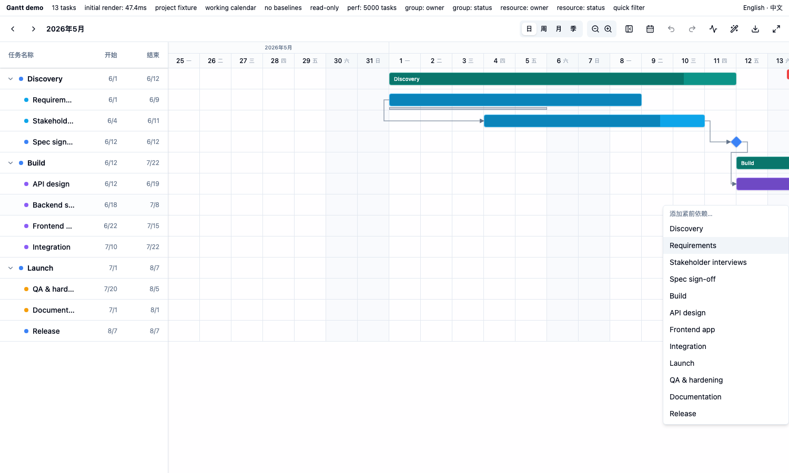

## Drag conflict + 顺延 confirmation — 拖拽冲突校验 + 顺延确认

`scripts/verify-conflict.mjs` drives the `?lang=zh` project fixture where t4
"Backend services" depends on t3 "API design" (FS). Dragging t4's bar to the
left so it would start before t3 finishes violates the link; with
`rescheduleOnConflict` on (auto-enabled whenever `dependenciesField` is set,
and gated off in `readOnly`), the move raises a confirmation prompt. Covered by
unit tests in [`GanttView.interactions.test.tsx`](../../src/GanttView.interactions.test.tsx)
(6 cases) and [`ObjectGantt.test.tsx`](../../src/ObjectGantt.test.tsx) (wiring).

The script asserts (5/5 checks passed):

- **冲突校验** — dragging t4 earlier raises a 排期冲突 dialog explaining the
  dependency violation and how many tasks would shift (自动顺延 / 取消保留).
- 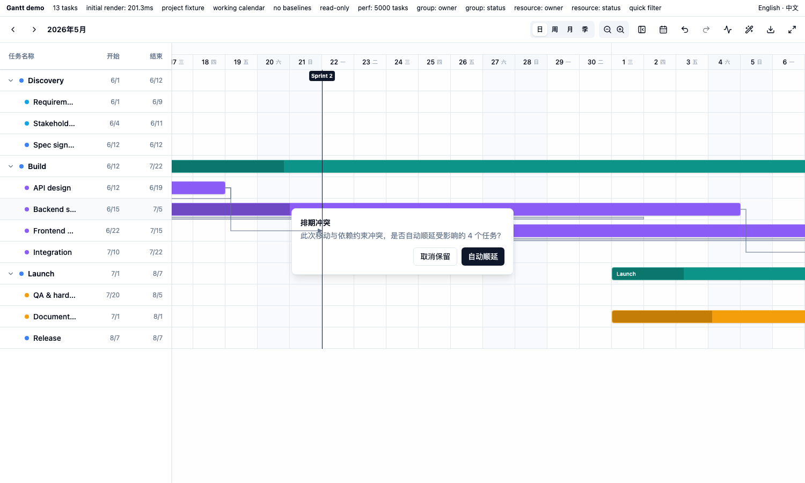
- **取消保留** — keeps the manual (earlier) placement and dismisses the prompt
  without rescheduling.
- 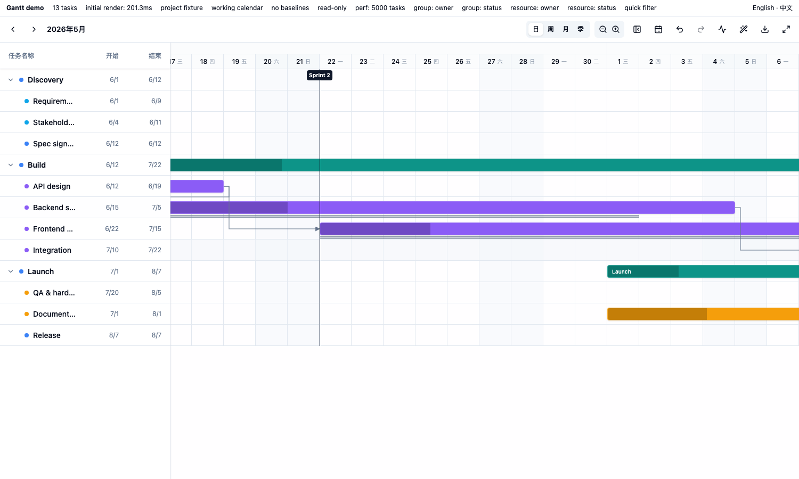
- **自动顺延** — re-dragging and confirming reschedules the affected tasks via a
  topological forward pass (FS/SS/FF/SF aware, summaries fixed), pushing t4 back
  to satisfy the link.
- 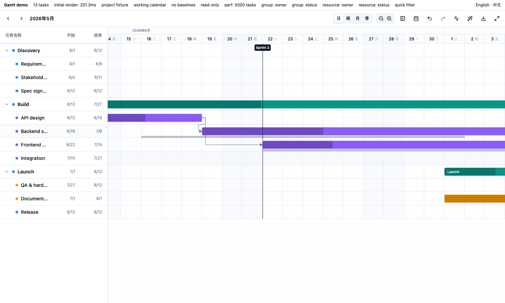
